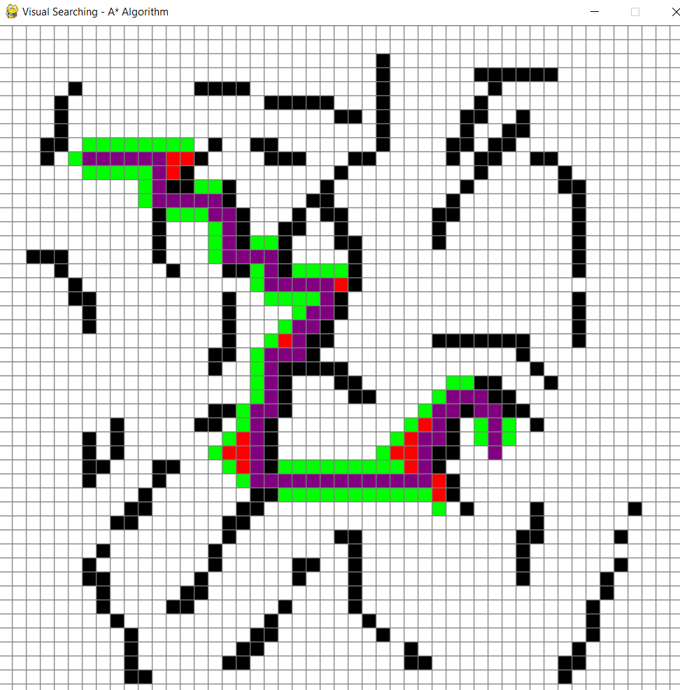
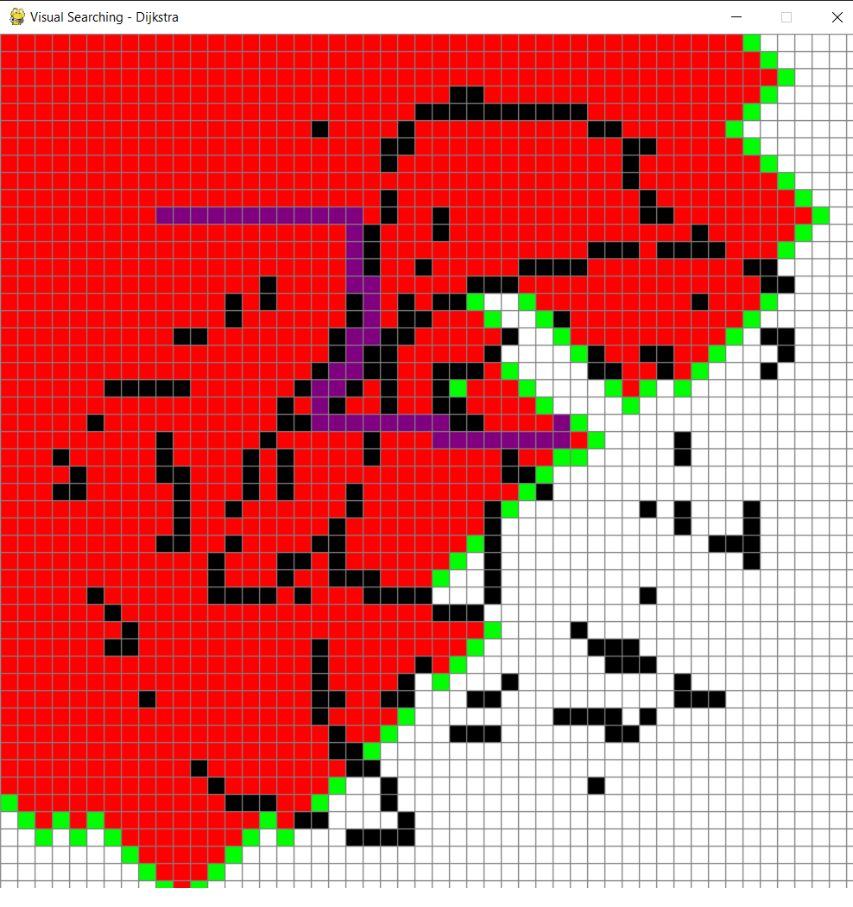

# Visual Pathfinding Algorithm Simulator

## Overview
The **Visual Pathfinding Algorithm Simulator** is a **Python** application that provides a graphical interface to visualize different **pathfinding algorithms**. The simulation allows users to create obstacles, set start and end points, and select an algorithm to see how it explores the grid.

## Application Screenshot
Below is an image of the Visual Pathfinding Algorithm Simulator interface:





## Features
- **Algorithms Supported:**
  - A* Search Algorithm
  - Depth-First Search (DFS)
  - Breadth-First Search (BFS)
  - Dijkstra’s Algorithm
- **Interactive Grid**:
  - Users can set start and end points
  - Draw obstacles to shape the environment
- **Real-Time Visualization**:
  - Shows how each algorithm explores the grid and finds the shortest path
- **Dynamic Controls**:
  - Press `1` for **A*** Search
  - Press `2` for **DFS**
  - Press `3` for **BFS**
  - Press `4` for **Dijkstra**
  - Use the **mouse** to draw or erase obstacles

## Technologies Used
- **Python** (Core programming language)
- **Pygame** (Graphical interface)
- **Priority Queue & Graph Structures** (For search algorithms)

## File Structure
```
VisualPathfinding/
│── src/
│   ├── visual_searching.py  # Main Python script
│── README.md  # This file
```

## Installation & Running the Application
### 1. Clone the Repository
```
git clone https://github.com/yourusername/VisualSearch.git
cd VisualSearch
```

### 2. Install Dependencies
Ensure you have Python and install `pygame`:
```
pip install pygame
```

### 3. Run the Application
```
python visual_searching.py
```

## How It Works
### **Setting Up the Grid**
1. Click on any cell to place **start (orange)** and **end (turquoise)** points.
2. Draw obstacles using the **left mouse button**.
3. Erase obstacles with the **right mouse button**.

### **Selecting an Algorithm**
- Press **`1`** for **A*** Search Algorithm
- Press **`2`** for **Depth-First Search (DFS)**
- Press **`3`** for **Breadth-First Search (BFS)**
- Press **`4`** for **Dijkstra’s Algorithm**
- Press **Space** to start the algorithm

### **Observing the Simulation**
- **Red cells**: Explored nodes
- **Green cells**: Open nodes (considered for expansion)
- **Purple cells**: Final shortest path

## Future Improvements
- Add **more pathfinding algorithms** (e.g., Greedy Best-First Search)
- Optimize visualization speed for larger grids
- Implement diagonal movement support


